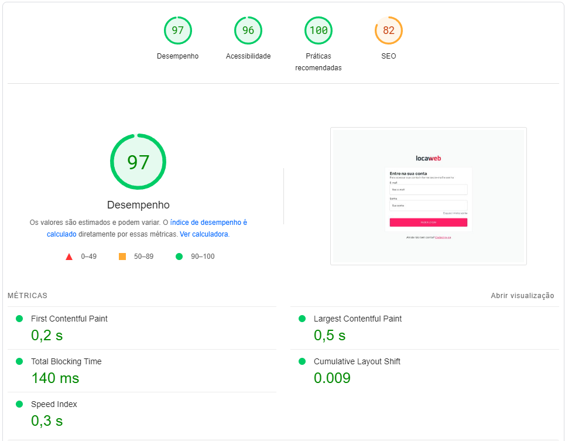

# locaweb

## Project setup
```
npm install
```

### Run Unit Tests
```
npm run test:unit
```

### Compiles and hot-reloads for development
```
npm run serve
```

### Compiles and minifies for production
```
npm run build
```

Site benchmark:



